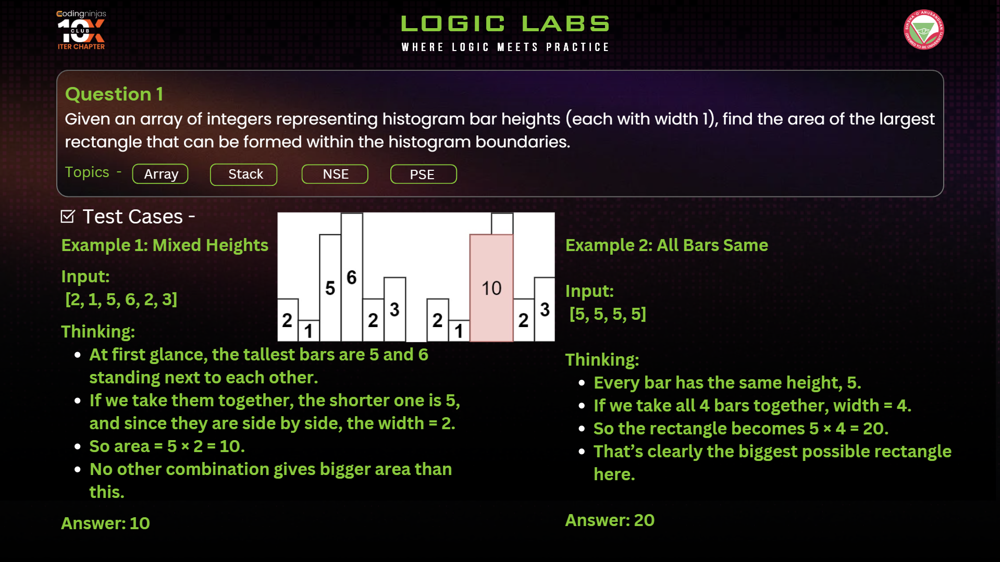

# Week-2
## Topics
 - Arrays
 - Stacks
 - NSE 
 - PSE

## Question
*Given an array of integers representing histogram bar heights (each with width 1), find the area of the largest rectangle that can be formed within the histogram boundaries.*

## Session PPT

- [📄 View PDF](./public/LOGIC_LABS_WEEK2.pdf)

## Question Slide 

